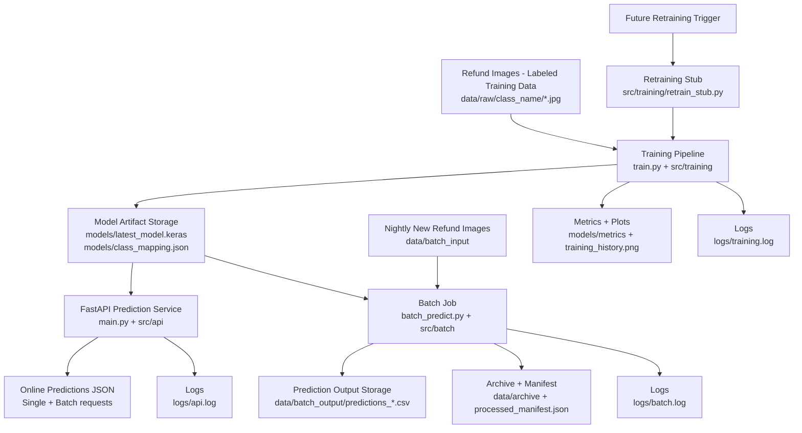

# Refund Image Classifier

Practical end-to-end ML + MLOps prototype for classifying refund item images into product categories, exposing predictions through an API, and running nightly batch inference.

## 1) Business Goal
An e-commerce refund team receives many returned product images. This project automates first-pass classification to reduce manual sorting effort and create a traceable, scalable workflow.

## 2) Conceptual Architecture



### Component overview
- `data/raw`: labeled images organized by class folders.
- Training pipeline: loads images, splits train/val/test, trains MobileNetV2 transfer model, evaluates, stores artifacts.
- `models/`: contains model file, class mapping, metrics, and training history plot.
- FastAPI service: loads saved model once and serves `/predict`, `/predict-batch`, `/predict-upload`, `/predict-upload-single`.
- Batch job: scans new files in `data/batch_input`, predicts, outputs CSV, archives processed images, updates manifest.
- Logs: per-component file logging in `logs/`.
- Retraining-ready: explicit retraining stub to extend later into scheduled model updates.

## 3) Open Dataset Choice
- **Dataset name**: Clothes Dataset (Kaggle, RyanBadai)
- **Source**: https://www.kaggle.com/datasets/ryanbadai/clothes-dataset?resource=download
- **Categories**: `blazer`, `coat`, `denim_jacket`, `dresses`, `hoodie`, `jacket`, `jeans`, `long_pants`, `polo`, `shirt`, `shorts`, `skirt`, `sports_jacket`, `sweater`, `t_shirt`
- **Dataset size in this project**: 7,500 images total (500 images per class)
- **Why this dataset**: directly aligned with apparel-return use case and balanced for a stable baseline demo.

### Assumptions and limitations
- Dataset quality and label consistency are assumed to be good.
- Current labels represent clothing type only; no condition/defect classification yet.
- Real refund operations may require multi-label outcomes (category + damage + reason).
- Accuracy is baseline-focused, not production optimized.

## 4) Project Structure

```text
refund-image-classifier/
├── data/
│   ├── raw/
│   ├── processed/
│   ├── batch_input/
│   ├── batch_output/
│   └── archive/
├── models/
├── notebooks/
├── src/
│   ├── data/
│   ├── features/
│   ├── training/
│   ├── inference/
│   ├── api/
│   ├── batch/
│   └── utils/
├── tests/
├── logs/
├── config/
│   └── config.yaml
├── main.py
├── train.py
├── batch_predict.py
├── requirements.txt
├── Dockerfile
├── docker-compose.yml
└── README.md
```

## 5) Setup

```bash
cd refund-image-classifier
python3 -m venv .venv
source .venv/bin/activate
pip install -r requirements.txt
```

## 6) Data Preparation
This repository does **not** include the full dataset files.  
Download the dataset from Kaggle and place images into class folders under `data/raw/`.

- **Dataset URL**: https://www.kaggle.com/datasets/ryanbadai/clothes-dataset?resource=download

### Option A: Download manually
1. Open the Kaggle URL above.
2. Download and unzip the dataset.
3. Copy the class folders into `data/raw/`.

### Option B: Download with Kaggle CLI
```bash
kaggle datasets download -d ryanbadai/clothes-dataset -p data
unzip data/clothes-dataset.zip -d data
```

After extracting, ensure the final structure in this project is:

```text
data/raw/
  blazer/
  coat/
  denim_jacket/
  dresses/
  hoodie/
  jacket/
  jeans/
  long_pants/
  polo/
  shirt/
  shorts/
  skirt/
  sports_jacket/
  sweater/
  t_shirt/
```

Notes:
- Keep files directly under each class folder (avoid nested subfolders).
- Use clean `snake_case` class names for consistent API outputs.
- Update `config/config.yaml` if using different categories or paths.

## 7) Train the Model

```bash
python train.py
```

Outputs:
- `models/latest_model.keras`
- `models/class_mapping.json`
- `models/training_history.png`
- `models/metrics/classification_report.json`
- `models/metrics/confusion_matrix.json`
- `logs/training.log`

## 8) Run API Service

```bash
uvicorn main:app --reload --host 0.0.0.0 --port 8000
```

### Endpoints
- `GET /health`
- `POST /predict` (single base64 image)
- `POST /predict-batch` (multiple base64 images)
- `POST /predict-upload` (multipart file uploads)
- `POST /predict-upload-single` (single multipart upload; easiest in Swagger UI)

### Example request (`/predict`)
```bash
python - <<'PY'
import base64, json, requests
img_path = "/Users/federicoalberino/refund-image-classifier/data/archive/example.jpg"
with open(img_path, "rb") as f:
    b64 = base64.b64encode(f.read()).decode("utf-8")
payload = {"filename": "example.jpg", "image_base64": b64}
r = requests.post("http://localhost:8000/predict", json=payload, timeout=60)
print(r.status_code)
print(json.dumps(r.json(), indent=2))
PY
```

### Example request (`/predict-upload-single`)
```bash
curl -X POST "http://localhost:8000/predict-upload-single" \
  -H "accept: application/json" \
  -F "file=@/Users/federicoalberino/refund-image-classifier/data/archive/example.jpg"
```

## 9) Nightly Batch Inference
Put new refund images into `data/batch_input/`, then run:

```bash
python batch_predict.py
```

Batch behavior:
- detects unprocessed images
- predicts using saved model
- writes timestamped CSV to `data/batch_output/`
- moves processed files to `data/archive/`
- updates `data/archive/processed_manifest.json`
- logs run in `logs/batch.log`

### Cron schedule example (every day at 01:30)
```cron
30 1 * * * cd /Users/federicoalberino/refund-image-classifier && /Users/federicoalberino/refund-image-classifier/.venv/bin/python batch_predict.py >> /Users/federicoalberino/refund-image-classifier/logs/cron_batch.log 2>&1
```

### Example batch CSV output row
```text
filename,predicted_label,predicted_index,probabilities_json
test_001.jpg,long_pants,7,"{""blazer"": 0.17831, ""coat"": 0.154472, ...}"
```

## 10) Run Tests

```bash
pytest -q
```

## 11) Docker (Optional)

```bash
docker compose up --build
```

## 12) Cloud Setup (Optional / Extra Credit)

### A) Deploy API to Render
1. Push this repository to GitHub.
2. Create a new **Web Service** in Render and connect your repository.
3. Select **Docker** runtime (Render will use the existing `Dockerfile`).
4. Deploy from `main` branch.
5. Verify cloud API:
   - `https://<your-render-service>.onrender.com/health`
   - `https://<your-render-service>.onrender.com/docs`

### B) Nightly batch in cloud (GitHub Actions)
Add workflow file `.github/workflows/nightly_batch.yml`:

```yaml
name: Nightly Batch Inference

on:
  schedule:
    - cron: "30 1 * * *"
  workflow_dispatch:

jobs:
  batch:
    runs-on: ubuntu-latest
    steps:
      - name: Checkout
        uses: actions/checkout@v4

      - name: Set up Python
        uses: actions/setup-python@v5
        with:
          python-version: "3.11"

      - name: Install dependencies
        run: pip install -r requirements.txt

      - name: Run batch prediction
        run: python batch_predict.py

      - name: Upload batch outputs
        uses: actions/upload-artifact@v4
        with:
          name: nightly-batch-output
          path: |
            data/batch_output/
            logs/batch.log
```

### Cloud note
- The current project uses local folders for batch input/output.
- For production-grade cloud persistence, replace local folders with object storage (AWS S3, Azure Blob, or GCS).

## 13) Design Decisions
- **TensorFlow + MobileNetV2**: simple transfer learning, laptop-friendly baseline.
- **FastAPI**: clean schema-driven API with built-in docs and validation.
- **Local file storage**: practical for prototype and easy to inspect.
- **CSV batch outputs + manifest**: traceable and idempotent nightly jobs.
- **Config-first approach**: easy updates without touching code.

## 14) Future Improvements
- Add domain dataset for real refund categories and class imbalance handling.
- Add model registry/versioning promotion workflow.
- Add experiment tracking (MLflow/W&B).
- Add drift monitoring and scheduled retraining automation.
- Add CI/CD and security hardening for deployment.
